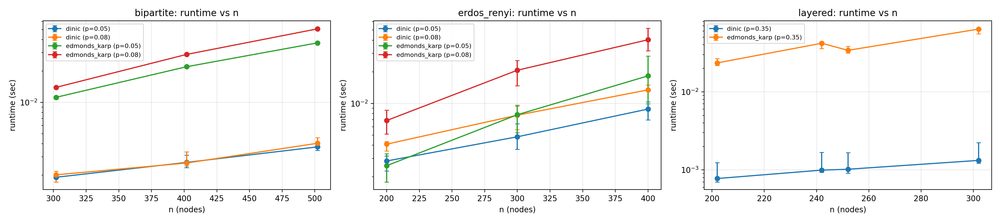
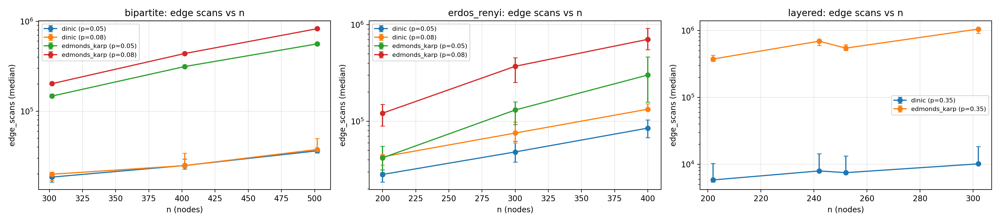
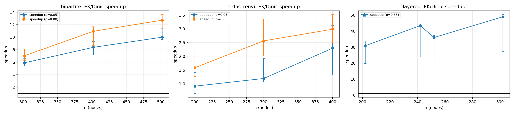
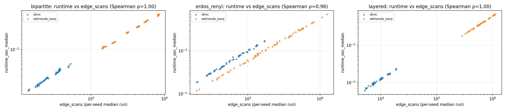
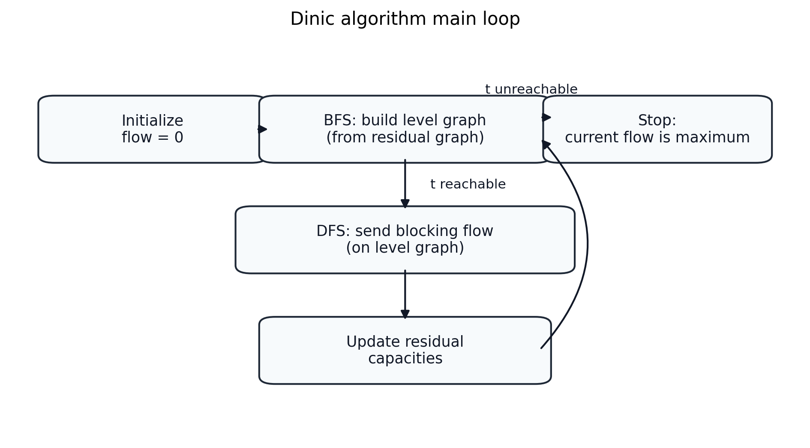
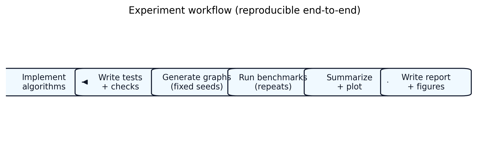
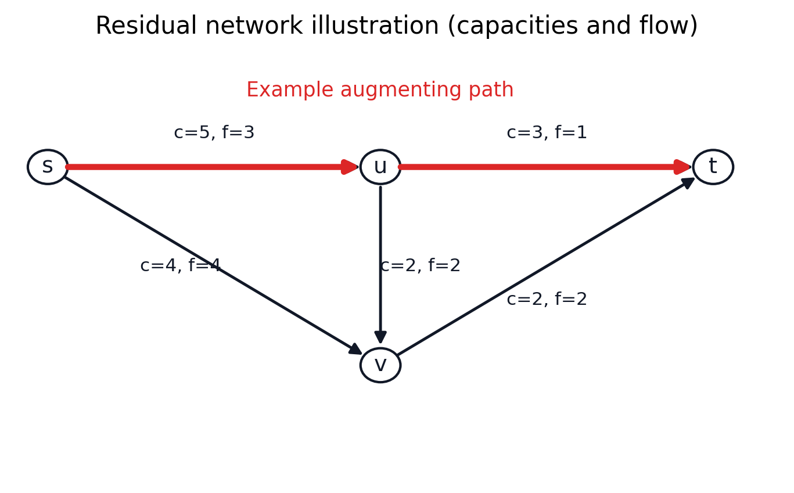

# Engineering Comparison of Max-Flow Algorithms (Edmonds–Karp vs Dinic)

## Assignment Requirements (from the handout)

Based on `CS215project(1).pdf`, the expected deliverables are:
- A **self-contained report** with clear organization and properly listed references.
- An **individual** project with meaningful scope/workload and a coherent write-up.
- Optional supplementary materials (e.g., code and/or a demo) that support the report.
- A topic in advanced graph theory; **network flow** is explicitly suggested.

## Abstract

This project implements two classic maximum-flow algorithms from scratch—Edmonds–Karp and Dinic—using a shared residual-graph data structure. We instrument both implementations with operation counters (e.g., BFS phases, augmentations, edge scans) and run reproducible parameter sweeps over multiple graph families. We also demonstrate two standard applications of max-flow: extracting an s–t minimum cut from the residual graph and computing bipartite maximum matching via a reduction to max-flow. Experiments use fixed seeds and repeated measurements per instance with robust aggregation (median + bootstrap CI), showing that Dinic is substantially faster on layered networks and typically faster on bipartite matching instances; results on random directed graphs are smaller but usually favor Dinic at these scales.

## Introduction

Maximum flow is a central primitive in graph theory and algorithms with applications ranging from cut problems to matching and scheduling. Although multiple correct algorithms exist, their practical performance can differ significantly depending on graph structure. This project builds an implementation-and-experiment “loop” to (1) compare Edmonds–Karp and Dinic empirically under controlled sweeps and (2) demonstrate how one max-flow implementation supports multiple downstream applications.

## Background

### Definitions

Let a flow network be a directed graph \(G=(V,E)\) with capacity function \(c: E \to \mathbb{R}_{\ge 0}\), a source \(s\), and a sink \(t\).
- A flow \(f\) assigns a value to each edge subject to capacity constraints \(0 \le f(e) \le c(e)\) and flow conservation at every vertex except \(s,t\).
- For any ordered pair \((u,v)\), define \(c(u,v)=0\) and \(f(u,v)=0\) when \((u,v)\notin E\). The **residual capacity** is:
  \[
  c_f(u,v)=c(u,v)-f(u,v)+f(v,u).
  \]
  The residual graph \(G_f\) contains every directed edge \((u,v)\) with \(c_f(u,v)>0\); the \(+f(v,u)\) term captures “reverse edges” that allow canceling previous flow.
- An augmenting path is an \(s\to t\) path in \(G_f\).
- An s–t cut partitions \(V\) into \(S\) (containing \(s\)) and \(T\) (containing \(t\)); its capacity is the sum of capacities of edges from \(S\) to \(T\).

### Max-Flow Min-Cut Theorem (statement)

The maximum value of any s–t flow equals the minimum capacity over all s–t cuts. In this project we validate the theorem empirically by extracting a cut from the final residual graph and checking that cut capacity equals the computed max-flow value.

### Algorithms compared

- **Edmonds–Karp**: a specialization of Ford–Fulkerson that always augments along a shortest (fewest edges) augmenting path found by BFS.
- **Dinic**: repeats BFS to build a level graph, then sends a blocking flow via DFS restricted to level edges (with a “current-arc” optimization).

## Methods

### Data structure

We implement a residual network with adjacency lists and explicit reverse edges:
- `src/dmh_flow/network.py`: `FlowNetwork` with `add_edge(u,v,cap)` creating a forward residual edge and a reverse residual edge; each edge stores `cap` (residual capacity) and `original_cap` (for forward edges).

In this implementation we do not store \(f\) explicitly. Instead, for an original edge \((u,v)\) we interpret the current flow as \(f(u,v)=\texttt{original\_cap}-\texttt{cap}\). The reverse residual edge’s `cap` corresponds to the cancelable amount \(f(u,v)\).

All experiment generators in `src/dmh_flow/generators.py` use **integer capacities** (or unit capacities for matching). Although the implementation stores capacities as `float`, on these inputs the optimal max-flow value is integral, and observed `flow_value` outputs are integers in our runs.

### Max-flow implementations and counters

Both algorithms return `(flow_value, counters)`:
- `src/dmh_flow/algorithms.py` implements:
  - `edmonds_karp` with counters: `bfs_count`, `augment_count`, `bfs_edge_scans`, `edge_scans`
  - `dinic` with counters: `phase_count`, `dfs_calls`, `bfs_edge_scans`, `dfs_edge_scans`, `edge_scans`

We define:
- `bfs_edge_scans`: number of residual edges inspected during BFS traversals
- `dfs_edge_scans`: number of residual edges inspected during DFS traversals (Dinic’s blocking-flow phase)
- `edge_scans = bfs_edge_scans + dfs_edge_scans`

These counters are a coarse, implementation-level proxy for “work” (distinct from wall-clock time).

Note on Dinic counters: in our implementation, `phase_count` counts the number of BFS constructions of the level graph, including the final BFS where the sink becomes unreachable and the algorithm terminates. We therefore treat `phase_count` as Dinic’s BFS count; additionally, `bfs_count` is incremented once per BFS for both algorithms.

### Correctness proof sketch

Both implementations follow the Ford–Fulkerson augmentation framework:
1. Start with the zero flow and its residual graph.
2. Find an augmenting path \(P\) in the residual graph.
3. Let \(\Delta=\min_{(u,v)\in P} c_f(u,v)\) and augment by \(\Delta\) along \(P\) (equivalently: decrease forward residual capacities and increase reverse residual capacities).

Key invariants (sketch):
- **Feasibility preserved**: residual capacities never go negative because \(\Delta\) is bounded by the bottleneck residual; flow conservation holds because internal vertices gain and lose the same \(\Delta\).
- **Progress**: each augmentation increases the flow value by \(\Delta>0\).
- **Optimality at termination**: if \(t\) is unreachable from \(s\) in the residual graph, let \(S\) be the set of vertices reachable from \(s\). Then \((S, V\setminus S)\) is an s–t cut and its capacity equals the current flow value (max-flow=min-cut). Our code extracts this cut via `min_cut` and checks `cut_capacity == flow_value` in tests and experiments.

### Applications

- **Min-cut extraction** (`src/dmh_flow/applications.py`): after max-flow terminates, BFS over residual edges with `cap>0` from `s` determines the reachable set \(S\). Cut edges are original edges from \(S\) to \(T\), and cut capacity is their total capacity.
- **Bipartite maximum matching via max-flow** (`src/dmh_flow/applications.py`): construct a flow network with `source -> U` capacity 1, `U -> V` capacity 1 for each bipartite edge, and `V -> sink` capacity 1. The max-flow value equals the maximum matching size; matched pairs are read from saturated `U -> V` edges.

Correctness of the matching reduction (sketch):
- Any matching induces a feasible unit flow by sending 1 along \(s\to u\to v\to t\) for each matched edge \((u,v)\).
- Any integral max-flow induces a matching by selecting the saturated \(u\to v\) edges; unit capacities ensure each vertex is used at most once.
Implementation note: because all capacities in the matching reduction are integers (unit capacities), integrality of max-flow implies an integral maximum flow value. In `src/dmh_flow/applications.py` we therefore identify matched pairs by checking whether the sent flow on a left→right edge is positive (no floating-point tolerance is required).

### Correctness and validation

We validate correctness via:
- Hand-checkable unit tests and deterministic randomized tests (`tests/`).
- Optional cross-check against NetworkX `maximum_flow_value` when NetworkX is installed (`tests/test_randomized.py`). This is used only as a value oracle (not as a performance baseline), and we do not rely on any particular default max-flow algorithm choice inside NetworkX (defaults may change across versions).
- A max-flow=min-cut consistency check: for every generated max-flow run in experiments, compute `min_cut` on the same residual graph and assert cut capacity equals flow value.

When using NetworkX for cross-checking, we treat it strictly as a value oracle: our conclusions depend only on value agreement, not on any specific NetworkX implementation details or default algorithm choices.

## Complexity (Theoretical)

Let \(V=|V|\) and \(E=|E|\) for the flow network.

**Edmonds–Karp.** The Edmonds–Karp algorithm runs in \(O(VE^2)\) time in the worst case (Edmonds & Karp, 1972; Cormen et al., 2022). Intuitively, each augmentation uses a BFS shortest augmenting path (cost \(O(E)\)), and the key lemma is that BFS distances in the residual graph are monotonically nondecreasing, which bounds the number of augmentations by \(O(VE)\).

**Dinic.** Dinic’s algorithm runs in \(O(V^2E)\) time in the standard adjacency-list implementation (Dinitz, 1970; Cormen et al., 2022). Each phase builds a level graph by BFS and sends a blocking flow by DFS restricted to level edges; the number of phases is at most \(V-1\), and the total DFS work per phase is \(O(VE)\) in the basic analysis.

**Unit networks (matching reduction).** Our bipartite matching reduction uses unit capacities and forms a “unit network” in the sense that internal vertices have a single incoming (right side) or outgoing (left side) unit-capacity edge. On unit networks, Dinic has a stronger bound \(O(E\sqrt{V})\) (cp-algorithms contributors, 2026), which helps explain why matching-style instances often show large speedups in practice.

## Worked Example

Consider a small network with vertices \(\{s,a,b,t\}\) and capacities:
- \(c(s,a)=2\), \(c(s,b)=2\)
- \(c(a,t)=2\), \(c(b,t)=1\)
- \(c(a,b)=1\)

Start with the zero flow, so initial residual capacities equal the original capacities and all reverse residual edges have capacity 0.

1. **First BFS augmenting path (Edmonds–Karp idea).** BFS from \(s\) finds a shortest augmenting path \(P_1: s \to a \to t\). The bottleneck is \(\Delta_1=\min\{c_f(s,a),c_f(a,t)\}=\min\{2,2\}=2\). We augment by \(\Delta_1\), i.e., decrease the forward residual capacities \(c_f(s,a)\) and \(c_f(a,t)\) by 2, and increase the reverse residual capacities \(c_f(a,s)\) and \(c_f(t,a)\) by 2. The flow value becomes 2.

2. **Second BFS augmenting path.** BFS now finds \(P_2: s \to b \to t\) with bottleneck \(\Delta_2=\min\{c_f(s,b),c_f(b,t)\}=\min\{2,1\}=1\). After augmenting, \(c_f(b,t)=0\) and the reverse residual \(c_f(t,b)\) increases by 1. The flow value becomes 3.

3. **Termination and min-cut extraction.** At this point, \(t\) is unreachable from \(s\) in the residual graph: from \(s\) we can still reach \(b\) (since \(c_f(s,b)=1\)), but we cannot traverse \(b\to t\) because its residual capacity is 0. Let \(S\) be the set of vertices reachable from \(s\) in the residual graph; here \(S=\{s,b\}\). The cut edges from \(S\) to \(V\setminus S\) are \((s,a)\) with capacity 2 and \((b,t)\) with capacity 1, so the cut capacity is 3, matching the computed max-flow value (Max-Flow Min-Cut Theorem).

## Experiments

### Reproducibility

- Experiment config: `scripts/configs/standard.json`
- Runner: `scripts/run_experiments.py` writes `results/exp_standard/{raw.csv,seed_summary.csv,summary.csv,config.json}`
- Plotter: `scripts/plot_results.py` writes `figs/exp_standard_*.png`
- One-shot command: `scripts/run_all.py`

The default config uses fixed seeds `0..9`, repeats `K=15` per (instance, algorithm), and sweeps multiple sizes/densities across three graph families:
- `erdos_renyi`: random directed graphs with capacities in `[1,20]`
- `layered`: multi-layer networks (edges only between adjacent layers)
- `bipartite`: bipartite graphs reduced to max-flow matching instances

### Metrics

We record per timed run:
- `runtime_ns` / `runtime_sec` (wall-clock around the algorithm call only; graph construction is excluded)
- `flow_value`
- operation counters (`bfs_count`, `augment_count`, `phase_count`, `dfs_calls`, `bfs_edge_scans`, `dfs_edge_scans`, `edge_scans`)

For aggregation and uncertainty:
- We take the **median** over the `K` repeats to get one runtime estimate per (seed, instance, algorithm) and save it in `seed_summary.csv`.
- Plots report the **median over seeds** with a **95% bootstrap CI**.
- Speedup is computed as a **paired ratio per seed**: \(S_i = T^{EK}_i / T^{Dinic}_i\), then aggregated across seeds (median + CI).

## Results

### Results at a glance

Best observed paired speedups (Edmonds–Karp / Dinic) across the current sweep, computed from `results/exp_standard/seed_summary.csv` using the same paired-speedup definition as `scripts/plot_results.py` (median over seeds + 95% bootstrap CI):

| family | n | p | layers | width | bipartite_n | speedup_median (95% CI) | seeds |
|---|---:|---:|---:|---:|---:|---:|---:|
| bipartite | 502 | 0.08 | - | - | 250 | 12.73 [11.02, 13.62] | 10 |
| erdos_renyi | 400 | 0.08 | - | - | - | 2.99 [2.48, 3.52] | 10 |
| layered | 302 | 0.35 | 10 | 30 | - | 48.99 [27.21, 50.35] | 10 |

Reproduce this table:

```bash
python scripts/summarize_results.py --exp results/exp_standard
```

Figures generated by `scripts/run_all.py`:









Key observations from `results/exp_standard/seed_summary.csv`, `results/exp_standard/summary.csv`, and the plots:
- **Layered graphs**: Dinic is consistently faster; best observed paired median speedup is 48.99× (95% CI [27.21, 50.35]) at `n=302, p=0.35, layers=10, width=30` (see table).
- **Bipartite matching networks**: Dinic is typically faster; best observed paired median speedup is 12.73× (95% CI [11.02, 13.62]) at `bipartite_n=250, p=0.08` (see table).
- **Random directed graphs (Erdős–Rényi)**: speedups are smaller; best observed paired median speedup is 2.99× (95% CI [2.48, 3.52]) at `n=400, p=0.08` (see table).
- **Runtime vs counters**: `figs/exp_standard_runtime_vs_edge_scans.png` shows a strong monotone relationship between runtime and `edge_scans` across families, supporting the use of counters as an explanatory diagnostic.

## Discussion

Dinic’s level-graph + blocking-flow approach can reduce repeated “global” BFS work compared to Edmonds–Karp’s one-augmenting-path-per-BFS behavior, especially on structured instances where many augmentations are needed. We therefore track BFS scans and DFS scans separately (`bfs_edge_scans` vs `dfs_edge_scans`) to avoid mixing search work across phases. On smaller random graphs, Python overhead and constant factors can dominate, explaining cases where speedup is near 1 (or even below 1).

On Erdős–Rényi graphs, speedups are typically smaller. Even for fixed \(n,p\), the realized edge count \(m\) can fluctuate noticeably across seeds, and Python-level constant factors become more prominent when the algorithmic gap is modest—both contribute to higher variance and reduced relative separation.

## Limitations

- Implementation language: Python constant factors limit maximum feasible graph sizes.
- Runtime variability: `runtime_sec` is not bit-for-bit reproducible across runs/machines; we mitigate this by fixed seeds, repeats per instance, and reporting medians with bootstrap CIs.
- Dataset scope: experiments use synthetic generators only; no external real-network datasets are included in this sweep.

## Conclusion

This project provides a reproducible framework for implementing and comparing max-flow algorithms, validating correctness via tests and max-flow=min-cut checks, and demonstrating standard reductions to min-cut and bipartite matching. In our experiments, Dinic shows clear advantages on layered and matching-style instances, while performance gaps on random directed graphs are smaller and more variable.

## References

1. Edmonds, J., & Karp, R. M. (1972). Theoretical improvements in algorithmic efficiency for network flow problems. *Journal of the ACM*, 19(2), 248–264.
2. Dinitz, E. A. (1970). Algorithm for solution of a problem of maximum flow in networks with power estimation. *Soviet Mathematics Doklady*, 11, 1277–1280.
3. Ford, L. R., & Fulkerson, D. R. (1962). *Flows in Networks*. Princeton University Press.
4. Ahuja, R. K., Magnanti, T. L., & Orlin, J. B. (1993). *Network Flows: Theory, Algorithms, and Applications*. Prentice Hall.
5. Cormen, T. H., Leiserson, C. E., Rivest, R. L., & Stein, C. (2022). *Introduction to Algorithms* (4th ed.). MIT Press.
6. Tarjan, R. E. (1983). *Data Structures and Network Algorithms*. SIAM.
7. Goldberg, A. V., & Tarjan, R. E. (1988). A new approach to the maximum-flow problem. *Journal of the ACM*, 35(4), 921–940.
8. Hopcroft, J. E., & Karp, R. M. (1973). An \(n^{5/2}\) algorithm for maximum matchings in bipartite graphs. *SIAM Journal on Computing*, 2(4), 225–231.
9. NetworkX Developers. (2026). NetworkX documentation (version 3.6.1): Flow algorithms reference. Retrieved 2026-01-11 from https://networkx.org/documentation/stable/reference/algorithms/flow.html
10. cp-algorithms contributors. (2026). Dinic’s algorithm (including unit network complexity). Retrieved 2026-01-11 from https://cp-algorithms.com/graph/dinic.html
11. Wikipedia contributors. (2026). Edmonds–Karp algorithm. In *Wikipedia*. Retrieved 2026-01-11 from https://en.wikipedia.org/wiki/Edmonds%E2%80%93Karp_algorithm

## Appendix

### Dinic main loop (diagram)



### Experiment workflow (diagram)



### Residual network illustration


